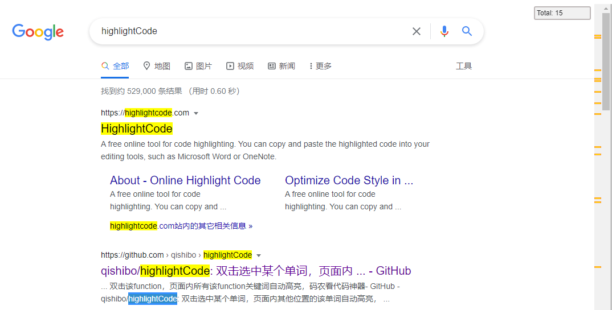

# highlightCode 关键词高亮
chrome拓展：双击选中某个词，页面内其他位置的相同词汇自动高亮!

比如查找某个function定义，双击该function，页面内所有该function自动高亮，**码农看代码神器**^_^

## 安装
1. [chrome商店](https://chrome.google.com/webstore/detail/%E5%85%B3%E9%94%AE%E8%AF%8D%E5%8F%8C%E5%87%BB%E8%87%AA%E5%8A%A8%E9%AB%98%E4%BA%AE/hiemiigjnmkjedjibioplldlbkhekbjk?gl=CN)

2. **源码安装方式**

`chrome 设置->更多工具->拓展程序->加载已解压的拓展程序 选择你解压之后的文件夹即可`

----------------------------

## 更新日志：

 - 2021-08-04 右侧增加匹配总数
 - 2020-07-03 修复双击时额外选中首尾空格造成的不能匹配
 - 2018-06-04 增加右侧位置预览，类似ctrl+F右侧边栏预览
 - 2018-05-03 支持iframe内高亮
 - 2018.04.13 点击拓展图标，可以设置双击时临时禁用高亮功能，防止在某些大页面内卡顿
 - 2018.04.12 选中长语句后，以前只能右键菜单选择高亮，现在通过`Alt+S`快捷键即可实现，再次按下取消高亮
 - 2017.11.14 某些情况下插入span会命中原有样式导致样式走形，改为自定义标签
 - 2016.11.30 增加右键菜单支持，可以选中多个字词，然后右键选择高亮相同字词
 - 2016.11.08 修复特殊字符如. * $等高亮的bug
 - 2016.10.02 双击关键词高亮 双击空白处|单击页面取消高亮
 - 2016.09.22 更改为遍历dom进行高亮 匹配更加精准
 - 2016.04.15 简单的替换body 简单粗暴

## 快捷键设置

> 设置`Alt+S`实现选中词句的高亮和取消高亮

1. 拓展管理页最底部

2. 设置高亮页面内容热键

----------------------------

[@齐士博](http://www.weibo.com/shiboooo)
